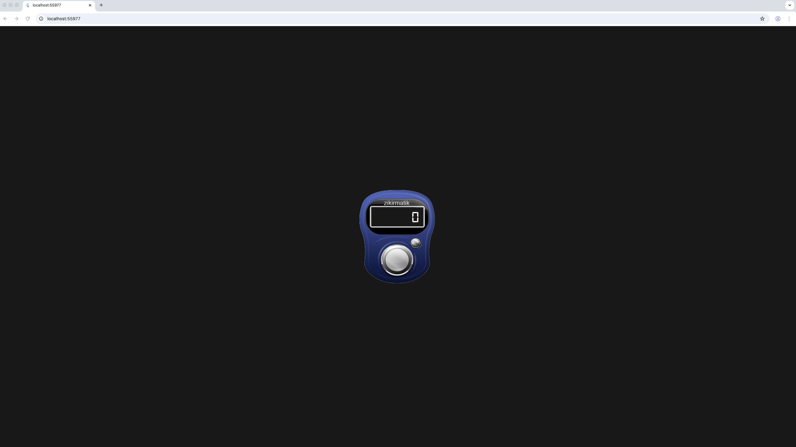

# Stack Widget Lesson – Overlaying Text on Image

This lesson demonstrates how to use the `Stack` widget in Flutter to overlay widgets — such as `Text` — on top of an image. It is part of a beginner-friendly Flutter UI development exercise.

## 🎯 What You’ll Learn

- Basics of the `Stack` widget
- How to use `Positioned` to control placement
- How to layer `Text` on top of an `Image.asset`
- Using `Scaffold`, `Column`, and `Center` for layout
- Styling text with custom fonts like `Digital7`

---

## Screenshot

The following screenshot illustrates the result of this lesson:



> This image is also used as the background in the actual Flutter app.

---

## 📁 File Structure
lib/
└── screens/
└── home_screen.dart
assets/
└── images/
└── zikirmatik.png
fonts/
└── Digital7.ttf
pubspec.yaml

## 🔧 pubspec.yaml Configuration

Make sure your `pubspec.yaml` contains:

```yaml
flutter:
  assets:
    - assets/images/zikirmatik.png

  fonts:
    - family: Digital7
      fonts:
        - asset: assets/fonts/Digital7.ttf
▶️ How to Run

flutter pub get
flutter run

