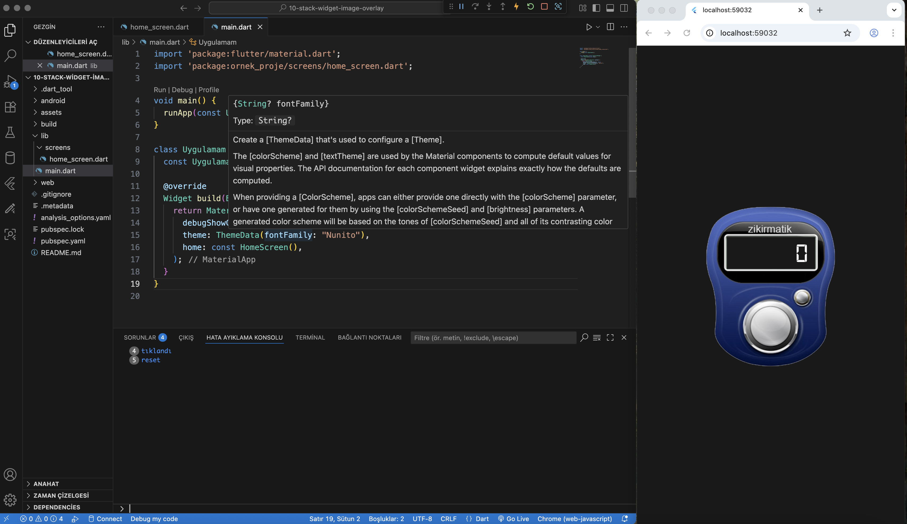

# 11-stack-gesture-overlay

This branch demonstrates a layered Flutter UI using the `Stack` widget combined with `GestureDetector` for interactive button-like areas over an image.

## Features

- Use of `Stack` and `Positioned` widgets for layered layout
- `GestureDetector` to detect taps on custom UI elements
- Private helper methods (e.g., `_counterText()`) to structure widget code
- `_` prefix in Dart indicates that a method or variable is private to the current file
- Digital-style counter text displayed over a background image
- Tappable reset and increment buttons positioned precisely over the image

## Purpose

To practice interactive, layered UI design in Flutter using Stack, custom tap areas, and private widget methods for cleaner code organization.


---

## Screenshot

The following screenshot illustrates the result of this lesson:



> This image is also used as the background in the actual Flutter app.

---

## 📁 File Structure
lib/
└── screens/
└── home_screen.dart
assets/
└── images/
└── zikirmatik.png
└── Screenshots/
└── screenshots.png


fonts/
└── Digital7.ttf
pubspec.yaml

## 🔧 pubspec.yaml Configuration

Make sure your `pubspec.yaml` contains:

```yaml
flutter:
  assets:
    - assets/images/zikirmatik.png

  fonts:
    - family: Digital7
      fonts:
        - asset: assets/fonts/Digital7.ttf
▶️ How to Run

flutter pub get
flutter run

