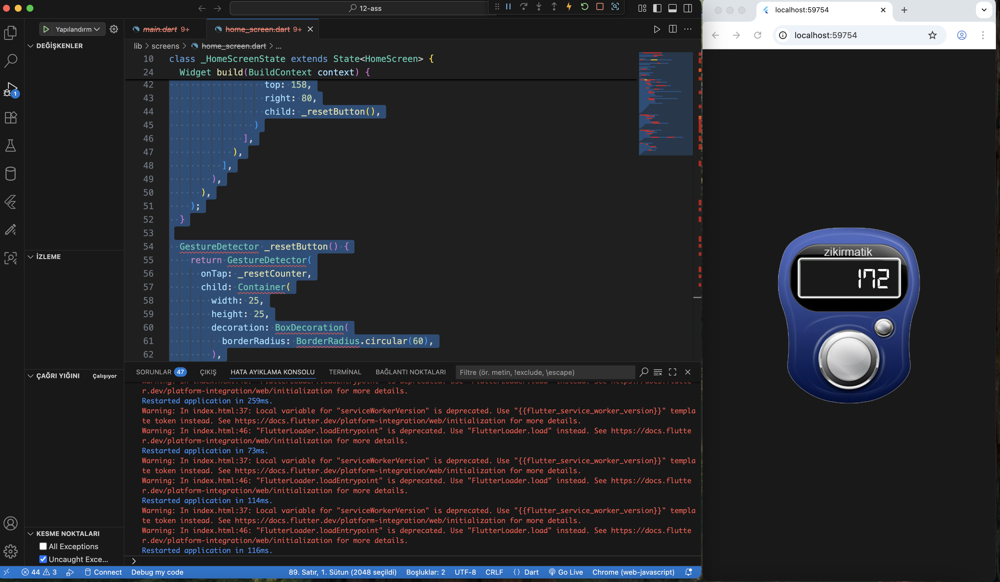
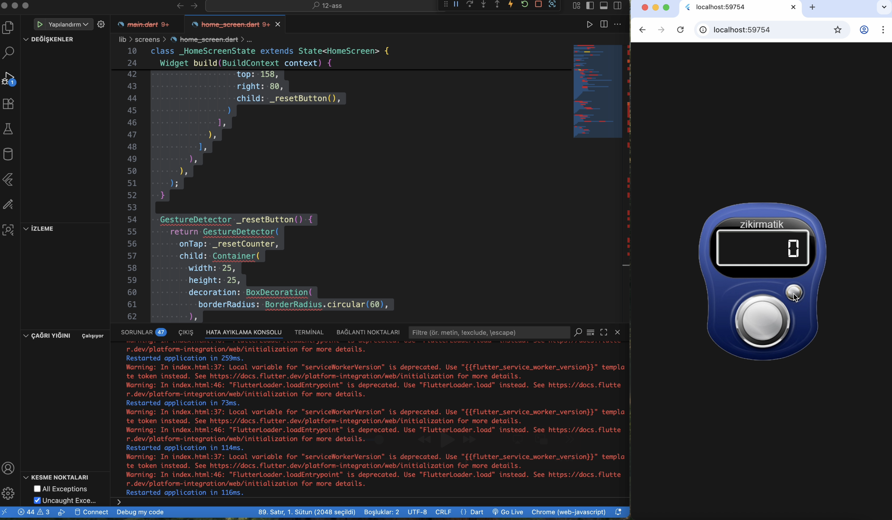

# 12-stateful-counter-overlay

This branch builds on the previous `Stack` layout by introducing state management with a `StatefulWidget`. The counter displayed on top of the image now dynamically updates as the user interacts with it.

## Features

- **StatefulWidget vs StatelessWidget**: 
  - A `StatelessWidget` cannot change its internal state once built.
  - A `StatefulWidget` can rebuild parts of the UI by calling `setState()` when its internal state changes.
- **Dynamic counter**: The counter value updates on tap using `GestureDetector` and `setState()`.
- **Stack + Positioned** layout: UI elements (text and invisible buttons) are overlaid on an image.
- **String interpolation**: Dart allows embedding variables directly into strings using `'$_counter'`.
- **Encapsulation with private methods**: The widget structure is cleanly organized with private helper methods like `_counterText()` and `_incrementButton()`.

## Purpose

To practice state management in Flutter, and demonstrate how UI can be updated in real time by combining `StatefulWidget`, `GestureDetector`, and `setState()` inside a layered `Stack` layout.


---

## Screenshot

The following screenshot illustrates the result of this lesson:





> This image is also used as the background in the actual Flutter app.

---

## 📁 File Structure
lib/
└── screens/
└── home_screen.dart
assets/
└── images/
└── zikirmatik.png
└── Screenshots/
└── screenshots.png
└── screenshots1.png


fonts/
└── Digital7.ttf
pubspec.yaml

## 🔧 pubspec.yaml Configuration

Make sure your `pubspec.yaml` contains:

```yaml
flutter:
  assets:
    - assets/images/zikirmatik.png

  fonts:
    - family: Digital7
      fonts:
        - asset: assets/fonts/Digital7.ttf
▶️ How to Run

flutter pub get
flutter run

